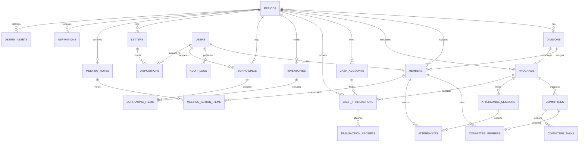

# SYSTEM ARCHITECTURE & DEVELOPER KICKSTART GUIDE
## Web Profil & Sistem Manajemen Organisasi HMTS UNTAD
**Stack:** Laravel 11/12 · Livewire 3 · Alpine.js · Tailwind CSS · PostgreSQL / MySQL / SQLite  
**Design Aesthetic:** Industrial Civil Engineering & Heavy Construction · Tactical Telemetry  
**Palette:** Canvas `#0C0712` · **CTA Kuning `#FFE500`** · **Pendukung Oranye `#CC6600`**  
**Timezone:** Asia/Makassar (WITA - UTC+8)  
**Versi Dokumen:** 3.0 (Civil Construction Edition)  
**Tanggal Pembaruan:** 7 Oktober 2026  

---

## 1. Panduan Memulai Proyek Cepat (Developer Kickstart: 0 to Running)

### 1.1 Persyaratan Sistem
- **PHP:** 8.3 atau 8.4 (Ekstensi: `pdo`, `mbstring`, `openssl`, `tokenizer`, `xml`, `gd` atau `imagick`, `curl`)
- **Composer:** 2.6+
- **Node.js & NPM:** Node 20 LTS atau 22 LTS, NPM 10+
- **Database:** PostgreSQL 16+ atau MySQL 8.0+ / MariaDB 10.11+ (atau SQLite 3.35+ untuk lokal)

### 1.2 Langkah Instalasi

```bash
# 1. Masuk ke root direktori repositori
cd hmts-web

# 2. Buat proyek Laravel baru (jika belum ada file framework)
composer create-project laravel/laravel:^11.0 . --prefer-dist

# 3. Pasang paket Composer inti
composer require livewire/livewire:^3.5 \
    spatie/laravel-permission:^6.9 \
    simplesoftwareio/simple-qrcode:^4.2 \
    maatwebsite/excel:^3.1 \
    barryvdh/laravel-dompdf:^3.0 \
    intervention/image-laravel:^1.3

# 4. Pasang auth starter kit (Breeze)
composer require laravel/breeze --dev
php artisan breeze:install blade --no-interaction

# 5. Pasang dependensi frontend NPM
npm install -D @tailwindcss/forms @tailwindcss/typography
npm install @alpinejs/mask @alpinejs/collapse html5-qrcode

# 6. Duplikasi dan sesuaikan file lingkungan (.env)
cp .env.example .env
php artisan key:generate

# 7. Hubungkan storage publik & buat direktori privat
php artisan storage:link
mkdir -p storage/app/private/receipts
mkdir -p storage/app/private/letters

# 8. Jalankan migrasi dan seeder awal
php artisan migrate --seed

# 9. Jalankan server pengembangan
php artisan serve
npm run dev
```

### 1.3 Konfigurasi Disk Storage Privat (`config/filesystems.php`)
```php
'disks' => [
    'public' => [
        'driver' => 'local',
        'root' => storage_path('app/public'),
        'url' => env('APP_URL').'/storage',
        'visibility' => 'public',
        'throw' => false,
    ],
    'private' => [
        'driver' => 'local',
        'root' => storage_path('app/private'),
        'visibility' => 'private',
        'throw' => true,
    ],
],
```

---

## 2. Ikhtisar Arsitektur Sistem: Modern Monolith (TALL Stack)

```
                      [ Pengunjung Publik ]         [ Pengurus & Anggota ]
                                │                              │
                         (Portal Publik)               (Dashboard /app)
                                │                              │
                                └───┐                      ┌───┘
                                    ▼                      ▼
                     ┌──────────────────────────────────────────────┐
                     │          Cloudflare CDN & Edge Proxy         │
                     │  (SSL, WAF, Turnstile Anti-Spam, Edge Cache) │
                     └──────────────────────┬───────────────────────┘
                                            │
                                            ▼
                     ┌──────────────────────────────────────────────┐
                     │             PHP 8.3+ (PHP-FPM)               │
                     │  ┌────────────────────────────────────────┐  │
                     │  │            Laravel 11/12 Engine        │  │
                     │  ├───────────────────┬────────────────────┤  │
                     │  │ Blade Views       │ Livewire 3 Engine  │  │
                     │  │ (Public Portal)   │ (/app Components)  │  │
                     │  ├───────────────────┴────────────────────┤  │
                     │  │ Middlewares (Auth, ActivePeriodScope,  │  │
                     │  │  RBAC Policies, Throttle, Turnstile)   │  │
                     │  ├────────────────────────────────────────┤  │
                     │  │ Eloquent ORM + Action Classes          │  │
                     │  └───────────────────┬────────────────────┘  │
                     └──────────────────────┼───────────────────────┘
                                            │
                     ┌──────────────────────┼───────────────────────┐
                     ▼                      ▼                       ▼
            ┌──────────────────┐  ┌──────────────────┐  ┌──────────────────────┐
            │   Database       │  │ Cache & Queues   │  │ Storage Disks        │
            │ (PostgreSQL/     │  │ (Database /      │  │ ├─ Public (Foto/Logo)│
            │  MySQL/SQLite)   │  │  Redis Driver)   │  │ └─ Private (Nota/PDF)│
            └──────────────────┘  └──────────────────┘  └──────────────────────┘
```

---

## 3. Diagram Entity-Relationship Database (ERD)



---

## 4. Pola Desain Perangkat Lunak Inti

### 4.1 Multi-Tenancy Temporal: `ActivePeriodScope`
```php
namespace App\Models\Scopes;

use App\Models\Period;
use Illuminate\Database\Eloquent\Builder;
use Illuminate\Database\Eloquent\Model;
use Illuminate\Database\Eloquent\Scope;
use Illuminate\Support\Facades\Session;

class ActivePeriodScope implements Scope
{
    public function apply(Builder $builder, Model $model): void
    {
        $periodId = Session::get('selected_period_id', function () {
            return cache()->remember('active_period_id', 3600, function () {
                return Period::where('is_active', true)->value('id');
            });
        });

        if ($periodId) {
            $builder->where($model->getTable() . '.period_id', $periodId);
        }
    }
}
```

### 4.2 Immutable Financial Ledger: `VoidCashTransactionAction`
```php
namespace App\Actions\Cash;

use App\Models\CashTransaction;
use App\Models\User;
use Illuminate\Support\Facades\DB;
use Illuminate\Validation\ValidationException;

class VoidCashTransactionAction
{
    public function execute(CashTransaction $transaction, string $reason, User $voidedBy): CashTransaction
    {
        if ($transaction->status === 'voided') {
            throw ValidationException::withMessages([
                'transaction' => 'Transaksi ini sudah pernah dibatalkan (void).'
            ]);
        }

        return DB::transaction(function () use ($transaction, $reason, $voidedBy) {
            $transaction->update([
                'status' => 'voided',
                'void_reason' => $reason,
                'voided_by_user_id' => $voidedBy->id,
                'voided_at' => now(),
            ]);

            $account = $transaction->cashAccount;
            if ($transaction->type === 'masuk') {
                $account->decrement('current_balance', $transaction->amount);
            } else {
                $account->increment('current_balance', $transaction->amount);
            }

            return $transaction;
        });
    }
}
```

### 4.3 Anti-Bentrok Jadwal Peminjaman: `CheckBorrowingConflictAction`
```php
namespace App\Actions\Inventory;

use App\Models\Inventory;
use Carbon\Carbon;
use Illuminate\Support\Facades\DB;

class CheckBorrowingConflictAction
{
    public function isAvailable(Inventory $inventory, int $requestedQty, Carbon $start, Carbon $end, ?int $excludeBorrowingId = null): bool
    {
        $reservedQty = DB::table('borrowing_items')
            ->join('borrowings', 'borrowings.id', '=', 'borrowing_items.borrowing_id')
            ->where('borrowing_items.inventory_id', $inventory->id)
            ->whereIn('borrowings.status', ['disetujui', 'sedang_dipinjam'])
            ->when($excludeBorrowingId, fn($q) => $q->where('borrowings.id', '!=', $excludeBorrowingId))
            ->where(function ($q) use ($start, $end) {
                $q->where('borrowings.start_time', '<', $end)
                  ->where('borrowings.expected_return_time', '>', $start);
            })
            ->sum('borrowing_items.qty');

        return ($inventory->total_qty - $reservedQty) >= $requestedQty;
    }
}
```
