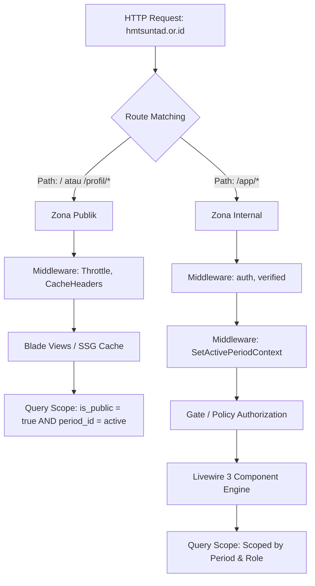
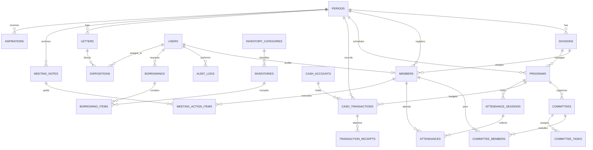

# SYSTEM ARCHITECTURE DOCUMENT
## Web Profil & Sistem Manajemen Organisasi HMTS UNTAD
**Stack:** Laravel 11/12 · Livewire 3 · Alpine.js · Tailwind CSS · PostgreSQL / MySQL  
**Status:** Architecture Blueprint v1.0  
**Tanggal:** 6 Oktober 2026  

---

## 1. Ikhtisar Arsitektur Sistem

Sistem HMTS UNTAD dibangun menggunakan paradigma **Modern Monolith (TALL Stack)** yang mengutamakan kesederhanaan operasional (*developer ergonomics*), performa tinggi, dan kemudahan deployment tanpa kompleksitas microservices atau decoupled single-page application (SPA).

```
                      [ Pengunjung Publik ]         [ Pengurus & Anggota ]
                                │                              │
                         (Halaman Publik)              (Dashboard /app)
                                │                              │
                                └───┐                      ┌───┘
                                    ▼                      ▼
                     ┌──────────────────────────────────────────────┐
                     │          Cloudflare CDN & Edge Proxy         │
                     │  (SSL, WAF, Turnstile Anti-Spam, Edge Cache) │
                     └──────────────────────┬───────────────────────┘
                                            │
                                            ▼
                     ┌──────────────────────────────────────────────┐
                     │          Nginx Web Server / Caddy            │
                     │        (Reverse Proxy, Static Assets)        │
                     └──────────────────────┬───────────────────────┘
                                            │
                                            ▼
                     ┌──────────────────────────────────────────────┐
                     │             PHP 8.3+ / PHP-FPM               │
                     │       ┌──────────────────────────────┐       │
                     │       │      Laravel 11/12 Engine    │       │
                     │       ├──────────────┬───────────────┤       │
                     │       │ Blade Views  │  Livewire 3   │       │
                     │       │  (Public)    │  Components   │       │
                     │       ├──────────────┴───────────────┤       │
                     │       │ Middlewares (Auth, Period,   │       │
                     │       │  RBAC Policies, Throttle)    │       │
                     │       ├──────────────────────────────┤       │
                     │       │ Eloquent ORM + Scopes        │       │
                     │       └──────────────┬───────────────┘       │
                     └──────────────────────┼───────────────────────┘
                                            │
            ┌───────────────────────────────┼───────────────────────────────┐
            ▼                               ▼                               ▼
┌──────────────────────┐        ┌──────────────────────┐        ┌──────────────────────┐
│  PostgreSQL / MySQL  │        │   Redis / DB Queue   │        │ Storage (Local / S3) │
│ (Relational Data &   │        │ (Sessions, Cache,    │        │ ├─ Public (Assets)   │
│  Period Scoping)     │        │  Async Workers)      │        │ └─ Private (Receipts)│
└──────────────────────┘        └──────────────────────┘        └──────────────────────┘
```

### Mengapa Laravel 11/12 + Livewire 3?
1. **Single Language & Ecosystem:** Seluruh logika bisnis, database schema, otorisasi, validasi, dan UI reaktif ditangani dalam PHP tanpa context-switching ke Node/TypeScript.
2. **Reaktivitas Tanpa REST/GraphQL API:** Livewire 3 menangani state frontend secara reaktif di server dan menyinkronkan DOM lewat payload JSON diff yang ringan, ideal untuk fitur seperti QR code timer, multi-account ledger, dan filter inventaris.
3. **Penyimpanan Terisolasi Aman:** Fitur native Laravel `Storage::temporaryUrl()` memudahkan pengamanan bukti nota kas dan surat rahasia tanpa konfigurasi rumit di sisi client.
4. **Biaya & Pemeliharaan Mandiri:** Dapat di-deploy di single-instance VPS (1-2 vCPU, 2-4GB RAM) yang sangat terjangkau bagi kas mahasiswa, tanpa ketergantungan pada vendor serverless berbayar tinggi.

---

## 2. Pemisahan Dua Zona (Domain & Routing Strategy)

Aplikasi berjalan dalam satu domain dengan pemisahan tegas pada level routing, controller/component, dan middleware:



---

## 3. Diagram Entity-Relationship Database (ERD)

Database dirancang dengan relasi integritas referensial yang ketat. Seluruh tabel operasional memuat `period_id` untuk isolasi multi-kepengurusan.



---

## 4. Definisi Skema Tabel Utama

### 4.1 Master Kepengurusan & Anggota
- **`periods`**:
  - `id` (BIGINT, PK)
  - `name` (VARCHAR: misal "Kabinet Sinergi 2026/2027")
  - `year_start` (SMALLINT), `year_end` (SMALLINT)
  - `is_active` (BOOLEAN, default: false)
  - `theme_slogan` (VARCHAR)
  - `created_at`, `updated_at`
- **`divisions`**:
  - `id` (BIGINT, PK)
  - `period_id` (FK -> `periods.id`, ON DELETE CASCADE)
  - `name` (VARCHAR: misal "Divisi Keilmuan & Keteknikan")
  - `slug` (VARCHAR)
  - `description` (TEXT)
  - `order_index` (INT)
- **`members`**:
  - `id` (BIGINT, PK)
  - `user_id` (FK -> `users.id`, NULLABLE, ON DELETE SET NULL)
  - `period_id` (FK -> `periods.id`, ON DELETE CASCADE)
  - `division_id` (FK -> `divisions.id`, NULLABLE, ON DELETE SET NULL)
  - `nim` (VARCHAR: 15, UNIQUE dalam satu periode)
  - `full_name` (VARCHAR)
  - `role_title` (VARCHAR: "Ketua Himpunan", "Sekretaris Umum", "Koordinator Divisi", "Anggota")
  - `specialization` (ENUM: Struktur, Transportasi, Geoteknik, Keairan, Manajemen Konstruksi)
  - `phone_number` (VARCHAR, ENCRYPTED via Laravel Eloquent Cast)
  - `avatar_path` (VARCHAR, NULLABLE)
  - `membership_status` (ENUM: aktif, demisioner, lulus)
  - `is_board_member` (BOOLEAN: apakah tampil di bagan pengurus)

### 4.2 Presensi Digital (M2)
- **`attendance_sessions`**:
  - `id` (BIGINT, PK)
  - `period_id` (FK -> `periods.id`)
  - `title` (VARCHAR: "Rapat Pleno Proker Civil Expo")
  - `type` (ENUM: rapat_pengurus, rapat_divisi, rapat_panitia, kegiatan)
  - `program_id` (FK -> `programs.id`, NULLABLE)
  - `qr_secret_token` (VARCHAR: di-regenerate dinamis via Cache)
  - `expires_at` (TIMESTAMP)
  - `is_active` (BOOLEAN)
- **`attendances`**:
  - `id` (BIGINT, PK)
  - `session_id` (FK -> `attendance_sessions.id`, ON DELETE CASCADE)
  - `member_id` (FK -> `members.id`, ON DELETE CASCADE)
  - `status` (ENUM: hadir, izin, sakit, alpa)
  - `check_in_time` (TIMESTAMP)
  - `proof_attachment_path` (VARCHAR, NULLABLE untuk surat dokter/izin)
  - `notes` (TEXT, NULLABLE)

### 4.3 Program Kerja & Kepanitiaan (M3 & M4)
- **`programs`**:
  - `id` (BIGINT, PK)
  - `period_id` (FK -> `periods.id`)
  - `division_id` (FK -> `divisions.id`)
  - `pic_member_id` (FK -> `members.id`, PJ Proker)
  - `name` (VARCHAR), `slug` (VARCHAR)
  - `description` (TEXT)
  - `start_date` (DATE), `end_date` (DATE)
  - `estimated_budget` (DECIMAL: 15,2)
  - `status` (ENUM: rencana, proses, selesai, evaluasi)
  - `is_public` (BOOLEAN, default: false)
  - `featured_image` (VARCHAR, NULLABLE)
- **`committees`**:
  - `id` (BIGINT, PK)
  - `program_id` (FK -> `programs.id`, ON DELETE CASCADE)
  - `name` (VARCHAR: "Panitia Pelaksana Civil Days 2026")
  - `event_date` (DATE)
- **`committee_members`**:
  - `id` (BIGINT, PK)
  - `committee_id` (FK -> `committees.id`)
  - `member_id` (FK -> `members.id`)
  - `position` (VARCHAR: "Ketua Panitia", "Koordinator Perlengkapan", dll.)
- **`committee_tasks`**:
  - `id` (BIGINT, PK)
  - `committee_id` (FK -> `committees.id`)
  - `title` (VARCHAR), `description` (TEXT)
  - `assigned_to` (FK -> `committee_members.id`)
  - `status` (ENUM: to_do, in_progress, review, done)
  - `due_date` (DATETIME)

### 4.4 Kas Digital & Bukti Nota (M5 & M6)
- **`cash_accounts`**:
  - `id` (BIGINT, PK)
  - `period_id` (FK -> `periods.id`)
  - `name` (VARCHAR: "Kas Umum HMTS", "Kas Dana Usaha", "Kas Civil Expo")
  - `code` (VARCHAR: "KAS-01")
  - `current_balance` (DECIMAL: 15,2)
- **`cash_transactions`**:
  - `id` (BIGINT, PK)
  - `period_id` (FK -> `periods.id`)
  - `cash_account_id` (FK -> `cash_accounts.id`)
  - `program_id` (FK -> `programs.id`, NULLABLE)
  - `recorded_by_user_id` (FK -> `users.id`)
  - `transaction_date` (DATE)
  - `type` (ENUM: masuk, keluar)
  - `category` (VARCHAR: iuran, sponsor, konsumsi, atk, transportasi, sewa_alat, dll.)
  - `amount` (DECIMAL: 15,2)
  - `party_name` (VARCHAR: nama penerima/pemberi dana)
  - `description` (TEXT)
  - `status` (ENUM: approved, pending_approval, voided)
  - `approved_by_user_id` (FK -> `users.id`, NULLABLE)
  - `void_reason` (TEXT, NULLABLE)
  - `voided_by_user_id` (FK -> `users.id`, NULLABLE)
  - `voided_at` (TIMESTAMP, NULLABLE)
- **`transaction_receipts`**:
  - `id` (BIGINT, PK)
  - `cash_transaction_id` (FK -> `cash_transactions.id`, ON DELETE CASCADE)
  - `file_path` (VARCHAR: path di disk private)
  - `file_name` (VARCHAR), `mime_type` (VARCHAR), `file_size` (INT)
  - `file_hash` (VARCHAR: SHA-256 integrity checksum)

### 4.5 Inventaris Alat & Peminjaman (M7 & M8)
- **`inventories`**:
  - `id` (BIGINT, PK)
  - `category_id` (BIGINT)
  - `item_code` (VARCHAR: "SIP-UKUR-001")
  - `name` (VARCHAR: "Total Station Nikon Nivo 2.M")
  - `description` (TEXT)
  - `total_qty` (INT), `available_qty` (INT)
  - `unit` (VARCHAR: "Unit", "Set", "Pcs")
  - `condition` (ENUM: sangat_baik, baik, rusak_ringan, perbaikan)
  - `storage_location` (VARCHAR: "Ruang Inventaris HMTS / Lemari A")
  - `photo_path` (VARCHAR, NULLABLE)
  - `is_borrowable` (BOOLEAN, default: true)
- **`borrowings`**:
  - `id` (BIGINT, PK)
  - `period_id` (FK -> `periods.id`)
  - `user_id` (FK -> `users.id`, NULLABLE jika peminjam publik terverifikasi)
  - `borrower_name` (VARCHAR), `borrower_phone` (VARCHAR), `borrower_id_number` (NIM/KTP)
  - `purpose` (VARCHAR: "Praktikum Ilmu Ukur Tanah", "Kegiatan BEM", dll.)
  - `start_time` (DATETIME), `expected_return_time` (DATETIME)
  - `actual_return_time` (DATETIME, NULLABLE)
  - `status` (ENUM: diajukan, disetujui, sedang_dipinjam, selesai, ditolak, terlambat)
  - `approved_by` (FK -> `users.id`, NULLABLE)
  - `checkout_notes` (TEXT, kondisi awal alat)
  - `checkin_notes` (TEXT, kondisi saat kembali)
- **`borrowing_items`**:
  - `id` (BIGINT, PK)
  - `borrowing_id` (FK -> `borrowings.id`, ON DELETE CASCADE)
  - `inventory_id` (FK -> `inventories.id`)
  - `qty` (INT)

### 4.6 Persuratan & Notulensi (M9 & M10)
- **`letters`**:
  - `id` (BIGINT, PK)
  - `period_id` (FK -> `periods.id`)
  - `direction` (ENUM: masuk, keluar)
  - `agenda_number` (VARCHAR)
  - `official_letter_number` (VARCHAR)
  - `sender_or_destination` (VARCHAR)
  - `letter_date` (DATE), `received_date` (DATE)
  - `subject` (VARCHAR)
  - `confidentiality` (ENUM: biasa, penting, rahasia)
  - `file_path` (VARCHAR, private storage)
  - `status` (ENUM: baru, didisposisikan, selesai)
- **`dispositions`**:
  - `id` (BIGINT, PK)
  - `letter_id` (FK -> `letters.id`, ON DELETE CASCADE)
  - `from_user_id` (FK -> `users.id`, Ketua/Sekretaris)
  - `to_member_id` (FK -> `members.id`, Penerima arahan)
  - `instruction` (TEXT)
  - `deadline` (DATE, NULLABLE)
  - `is_acknowledged` (BOOLEAN)
- **`meeting_notes`**:
  - `id` (BIGINT, PK)
  - `period_id` (FK -> `periods.id`)
  - `title` (VARCHAR)
  - `meeting_date` (DATETIME)
  - `leader_member_id` (FK -> `members.id`)
  - `writer_member_id` (FK -> `members.id`)
  - `attendance_session_id` (FK -> `attendance_sessions.id`, NULLABLE)
  - `agenda` (TEXT), `discussion_summary` (LONGTEXT), `final_decisions` (LONGTEXT)
  - `pdf_path` (VARCHAR, NULLABLE)

### 4.7 Aspirasi Anonim & Aset Desain (M11 & M12)
- **`aspirations`**:
  - `id` (BIGINT, PK)
  - `period_id` (FK -> `periods.id`)
  - `ticket_code` (VARCHAR: 16, UNIQUE: misal `ASP-2026-X9B21`)
  - `category` (ENUM: akademik, sarana_prasarana, kemahasiswaan, kinerja_himpunan, lainnya)
  - `message` (TEXT)
  - `status` (ENUM: baru, ditinjau, ditindaklanjuti, dijawab, diarsipkan)
  - `admin_response` (TEXT, NULLABLE)
  - `responded_at` (TIMESTAMP, NULLABLE)
  - *Perhatian: Tidak ada kolom `user_id`, `ip_address`, atau informasi identitas apapun.*
- **`design_assets`**:
  - `id` (BIGINT, PK)
  - `title` (VARCHAR: "Logo HMTS UNTAD Vektor Master")
  - `category` (ENUM: logo, kop_surat, guideline, font, template_ppt)
  - `file_path` (VARCHAR, NULLABLE untuk file lokal)
  - `external_link` (VARCHAR, NULLABLE untuk Google Drive/Figma)
  - `is_public` (BOOLEAN, default: true)
  - `download_count` (INT, default: 0)

---

## 5. Pola Desain Perangkat Lunak (Software Patterns)

### 5.1 Multi-Tenancy Temporal via `ActivePeriodScope`
Untuk menjamin tidak ada kebocoran data antarperiode saat pergantian kabinet, dibuat Global Scope Eloquent:

```php
namespace App\Models\Scopes;

use Illuminate\Database\Eloquent\Builder;
use Illuminate\Database\Eloquent\Model;
use Illuminate\Database\Eloquent\Scope;
use Illuminate\Support\Facades\Session;

class ActivePeriodScope implements Scope
{
    public function apply(Builder $builder, Model $model): void
    {
        // Jika ada filter periode di session (misal admin melihat arsip), pakai periode itu
        $periodId = Session::get('active_period_id', function () {
            return cache()->remember('default_active_period_id', 3600, function () {
                return \App\Models\Period::where('is_active', true)->value('id');
            });
        });

        if ($periodId) {
            $builder->where($model->getTable() . '.period_id', $periodId);
        }
    }
}
```

Model yang menggunakan scope ini: `Member`, `Program`, `CashTransaction`, `Borrowing`, `Letter`, `MeetingNote`.

### 5.2 Immutable Financial Ledger Pattern
Transaksi kas dilindungi dari mutasi langsung:
1. Tidak ada method `delete()` atau `update()` untuk nilai nominal transaksi di Livewire komponen.
2. Koreksi dilakukan dengan Action Class `VoidCashTransactionAction`:
   ```php
   class VoidCashTransactionAction
   {
       public function execute(CashTransaction $transaction, string $reason, User $voidedBy): void
       {
           DB::transaction(function () use ($transaction, $reason, $voidedBy) {
               $transaction->update([
                   'status' => 'voided',
                   'void_reason' => $reason,
                   'voided_by_user_id' => $voidedBy->id,
                   'voided_at' => now(),
               ]);
               
               // Kembalikan saldo akun
               $account = $transaction->cashAccount;
               if ($transaction->type === 'masuk') {
                   $account->decrement('current_balance', $transaction->amount);
               } else {
                   $account->increment('current_balance', $transaction->amount);
               }

               // Catat di Audit Log
               AuditLogger::log('cash.void', $transaction, ['reason' => $reason]);
           });
       }
   }
   ```

### 5.3 Anti-Bentrok Jadwal Peminjaman (Conflict Detector Algorithm)
Sebelum menyetujui peminjaman alat di `BorrowingService`:
```sql
SELECT b.id, bi.qty 
FROM borrowings b
JOIN borrowing_items bi ON bi.borrowing_id = b.id
WHERE bi.inventory_id = :inventory_id
  AND b.status IN ('disetujui', 'sedang_dipinjam')
  AND (b.start_time < :requested_end_time AND b.expected_return_time > :requested_start_time);
```
Sisa stok dihitung: `available_qty_realtime = total_qty - SUM(overlapping_reserved_qty)`.

---

## 6. Strategi Keamanan & Privasi Data

1. **Akses Berkas Privat (Nota Kas & Surat Rahasia):**
   - Bukti nota disimpan di `storage/app/private/receipts/{period_id}/{filename}`.
   - Tidak dibuat symlink ke web root.
   - Akses gambar di Livewire menggunakan signed URL:
     ```php
     URL::temporarySignedRoute(
         'receipts.preview', 
         now()->addMinutes(10), 
         ['receipt' => $receipt->id]
     );
     ```
   - Controller memeriksa Policy `ReceiptPolicy::view($user, $receipt)` sebelum me-render binary stream (`response()->file(...)`).

2. **Perlindungan Anonimitas Aspirasi:**
   - IP Pengirim **tidak pernah disimpan** ke database.
   - Deteksi spam menggunakan:
     - Cloudflare Turnstile token validation.
     - Rate limit menggunakan cache key: `sha256($request->ip() . config('app.key') . date('Y-m-d'))` (salt harian berubah otomatis setiap tengah malam).
   - Pengirim menerima kode tiket acak `Str::random(12)` untuk mengecek respon pengurus.

3. **UU PDP (Pelindungan Data Pribadi):**
   - Kolom nomor telepon anggota di-enkripsi di database menggunakan Laravel Attribute Casting:
     ```php
     protected function casts(): array {
         return ['phone_number' => 'encrypted'];
     }
     ```
   - Tampilan nomor telepon di panel non-sekretaris/ketua di-masking (`0812-****-1234`).

---

## 7. Antrian & Latar Belakang (Queue & Schedule)

- **Driver:** Redis (Production) atau Database Driver (Development/Standard VPS).
- **Scheduled Cron Jobs (`routes/console.php`):**
  - `0 1 * * *` : Otomatis periksa batas pengembalian inventaris dan tandai status `terlambat`.
  - `*/1 * * * *` : Regenerasi token rahasia sesi QR absensi aktif di cache.
  - `0 2 * * 0` : Spatie Laravel Backup (Backup database + zip private storage ke cloud storage terpisah).
- **Queued Jobs:**
  - `SendEmailNotificationJob`: Kirim email notifikasi disposisi dan approval dana.
  - `OptimizeReceiptImageJob`: Kompresi otomatis resolusi bukti nota menjadi WebP (maksimal 1200px lebar, kualitas 80%) menggunakan GD/Imagick.
  - `GenerateFinancialReportPdfJob`: Render PDF neraca kas untuk LPJ tanpa memblokir antarmuka pengguna.

---

## 8. Infrastruktur & Deployment Blueprint

### Rekomendasi Production VPS:
- **Server:** Ubuntu 24.04 LTS (2 vCPU, 2-4 GB RAM, 40-80 GB SSD NVMe).
- **Web Server:** Nginx 1.24+ dengan HTTP/2 dan TLS 1.3.
- **PHP:** PHP 8.3-FPM dengan OPcache aktif (`opcache.enable=1`, `opcache.jit=tracing`).
- **Database:** PostgreSQL 16 atau MariaDB 11.
- **Process Manager:** Supervisor untuk menjalankan `php artisan queue:work --sleep=3 --tries=3`.

```
/var/www/hmts-untad/
  ├── current -> /var/www/hmts-untad/releases/20261006_v1
  ├── shared/
  │    ├── .env
  │    └── storage/
  │         ├── app/
  │         │    ├── public/
  │         │    └── private/
  │         └── logs/
```
Deployment dapat menggunakan CI/CD GitHub Actions sederhana via SSH rsync atau tool open-source seperti **Coolify / Deployer**.
